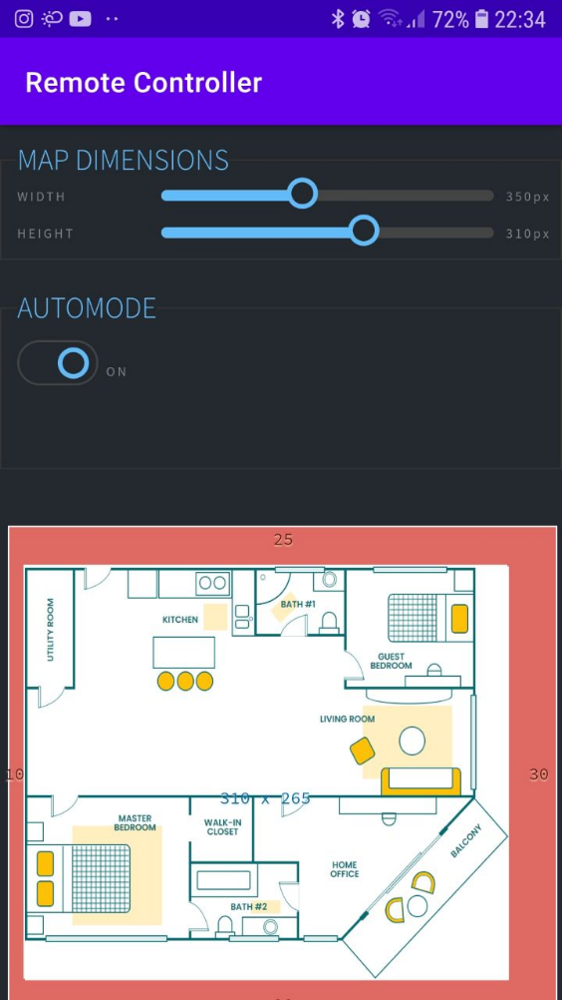

# MПР-01
## Малий Побутовий Робот - 01

<!-- blank line -->
<figure class="video_container">
  <iframe src="https://www.youtube.com/embed/_fWBUstYvjs" frameborder="0" allowfullscreen="false"> </iframe>
</figure>
<!-- blank line -->

Даний робот призначений для пошуку дрібних предметів, що можуть становити загрозу через свій розмір.

До технічних складових робота відносяться:
- [Arduino Due] (Atmel SAM3X8E ARM Cortex-M3)
- [драйвер мотора L298N](https://www.sparkfun.com/datasheets/Robotics/L298_H_Bridge.pdf)
- [Wi-Fi мікроконтролер (ESP8266-01)](http://www.microchip.ua/wireless/esp01.pdf)
- [ультразвуковий датчик відстані HC-SR04](https://cdn.sparkfun.com/datasheets/Sensors/Proximity/HCSR04.pdf)
- інфрачервоні датчики предметів YL-63
- фоторезистор
- світлодіоди
- сервоприводи
- електродвигуни

## Розробка апаратного забезпечення (Вербовський І.)
[Arduino Due] створений основі Atmega SAM3X8E процесор ARM Cortex-м3. Це перший Arduino на основі мікроконтролера 32-бітних ARM ядер. Вона має 54 цифрових вводу-виводу (з яких 12 можуть бути використані під ШІМ-виходи), 12 аналогових входів, 4 апаратні послідовні порти, 84 МГц частоти генератор, посилання USB OTG включений, 2 КСР (цифрово-аналоговий конвертер) 2, ТВІ, SPI роз'єм живлення, роз'єм JTAG сполучну лінію, кнопка скидання.
Програмування мікроконтролера та створення алгоритму відбувалось за допомогою мови програмування С та команд Arduino. Для зручного введення, середовище – [Arduino IDE], що дозволяє не тільки створити програмний код, а й виконати компіляцію для мікроконтролера у форматі .ino, яка буде зашита в мікроконтролер за допомогою програматора.
Для коректної автономної роботи робота був розроблений алгоритм та відтворений спочатку у вигляді блок-схеми. а потім реалізований у коді. Коректність досягається застосуванням псевдо-паралельних процесів. 
Мікропроцесор може виконувати алгоритмічні дії майже без затримки, але щоб не було некоректних проблем між тактами роботи є пауза у 1 секунду. Кожне завдання виконується за таймером, за кожен так відбувається перевірка всіх тактів та якщо час завдання підійшов до виконання то воно виконується, а таймер переводиться на відповідний час уперед.
«Зором» робота є ультразвуковий сенсор, що здійснює аналіз ситуації перед роботом, та приймає рішення згідно алгоритму. Інфрачервоні датчики перевіряють «сліпі» зони робота та допомагають у орієнтації у просторі. Додаткові інфрачервоні датчики предмету перевіряють зміну висоти підлоги на можливе знаходження предмету під роботом.
Керування роботом може відбуватись у двох головних режимах: ручному та автономному. Вибір режиму та дані з сенсорів можна отримати використовуючи додаток на будь якій платформі користувача.

## Керування за допомогою кросплатформенного застосунку
#### [Веб-версія (Шендріков Є.)](https://github.com/JackShen1/robotcar-ui)
Для написання серверу мною використовувався шаблон дизайну програмного забезпечення під назвою Модель-вигляд-контролер (зазвичай відомий як MVC), який зазвичай використовується для розробки користувацького інтерфейсу, що розділяє відповідну логіку програми на три взаємопов'язані елементи.
Для зберігання даних користувача мною використовувались два варіанти реляційних систем керування базами даних, а саме SQLite (на локальному комп’ютері) і PostgreSQL (на сервері).
Використання БД пояснюється можливістю авторизації користувача перед входом на сервер, а також необхідністю приховати від звичайного користувача певні дані.
Всі важливі дані користувача типу паролів зашифровуються асиметричними ключами за допомогою технології SHA256 і не зберігаються в БД у вигляді простого тексту. Сам сервер використовує захищене з’єднання HTTPS. Також було втілено до серверу захист від різних типів атак, в основному це стосується захисту від CSRF-атак. Як відомо, міжсайтова підробка запиту (Cross-site request forgery) – тип веб-атаки, що призводить до виконання певних дій від імені користувача на веб-сторінці де останній аутентифікований.
Сторінка проекту нашої групи оформленна за допомогою фреймворку Angular, оскільки він містить вбудовані можливості для створення достатньо прогресивного графічного інтерфейсу та анімації.
Дана сторінка може відображати карту приміщення з місцезнаходженням робота, її швидкість і дистанцію, також має відповідні індикатори. Є можливість змінювати розмір карти приміщення і додавати рамку до карти (для кращого вигляду).

#### Android-версія (Мамотенко Б.)
Мовою програмування для мобільної розробки на операційній системі Android послугувала Java (об’єктно – орієнтована мова програмування). 
Створення додатку було здійснене у декілька етапів:
1.	Проект в Android Studio
2.	Створення інтерфейсу користувача
3.	Впровадження активностей, навігації і дій
4.	Тест кінцевого додатку

Цей проект базується на технології WebView. Суть цього методу полягає в тому, що додаток є браузером, але для користувача це звичайна програма. 

 

#### iOS-версія (Полюхович А.)
Для керування малим побутовим роботом було розроблено спеціальні додатки для операційної системи IOS (для мобільних телефонів компанії Apple – iPhone), які підходять для будь-якої версії IOS. 
Додаток, побудований за допомогою програми Xcode 12, використано мову Swift, а для побудови візуальної частини програми - SwiftUI. Основний принцип його роботи - це використання WebView.

 

## Висновки
Покращені навички роботи та розподілення завдань в команді. Розроблений продукт є зручним до використання, має достатньо функцій та здатен до роботи у кімнаті, або на будь якій пласкій поверхні. Керування працює, спроектовані додатки були протестовані у реальних умовах. 
Проблем під час тестування не виникало, датчики були налаштовані. Однак світловий рівень достатньо сильно впливає на коректність вибору предметів, через оптичні властивості предметів. Також деякі предмети можуть некоректно взаємодіяти зі звуковими хвилями, тож ультразвуковий датчик має похибку. Однак подальше доопрацювання, налаштування, використання додаткових датчиків вирішить дану проблему.

***Дякую за увагу***

[Arduino Due]: https://doc.arduino.ua/ru/hardware/Due
[Arduino IDE]: https://www.arduino.cc/en/main/OldSoftwareReleases
